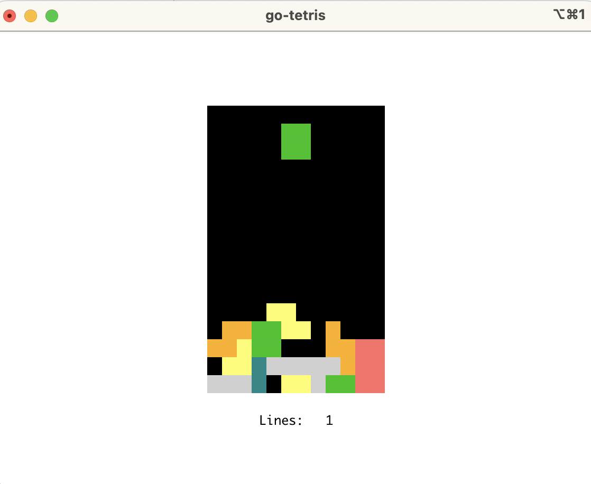

# go-tetris

TUI and WASM tetris in go using [tcell](https://github.com/gdamore/tcell).

This program can be used either in a terminal as a native app, or as a [WASM app embedded into a webpage](https://github.com/gdamore/tcell/blob/main/README-wasm.md).

WASM demo: https://aaronr.digital/tetris

## Keys:

- Escape, Q: quit
- R: restart
- Left Arrow: move piece left
- Right Arrow: move piece right
- Up Arrow: rotate piece
- Down Arrow: move piece down
- Space Bar: drop piece
- V: toggle showing version info

## Screenshot:

