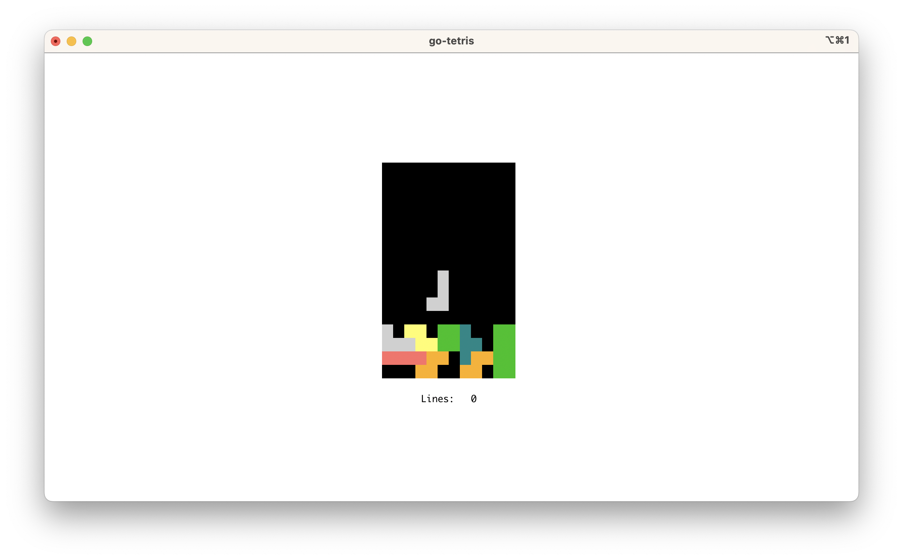

# go-tetris

TUI and WASM tetris in go using [tcell](https://github.com/gdamore/tcell).

This program can be used either in a terminal as a native app, or as a [WASM app](https://github.com/gdamore/tcell/blob/main/README-wasm.md).

## Play as a WASM app:

- https://aaronriekenberg.github.io/go-tetris/
- Deployed to github pages on every commit by github actions.

## Keys:

- Escape, Q: quit (non-WASM only)
- R: restart
- Left Arrow: move piece left
- Right Arrow: move piece right
- Up Arrow: rotate piece
- Down Arrow: move piece down
- Space Bar: drop piece
- V: toggle showing version info

## Finger/Mouse Events:

- Click above board: rotate piece
- Click below board: move piece down
- Double click below board: drop piece
- Click near left of board: move current piece left
- Click near right of board: move current pice right

## Screenshots:

Native app in iTerm2:

WASM in Chrome:

